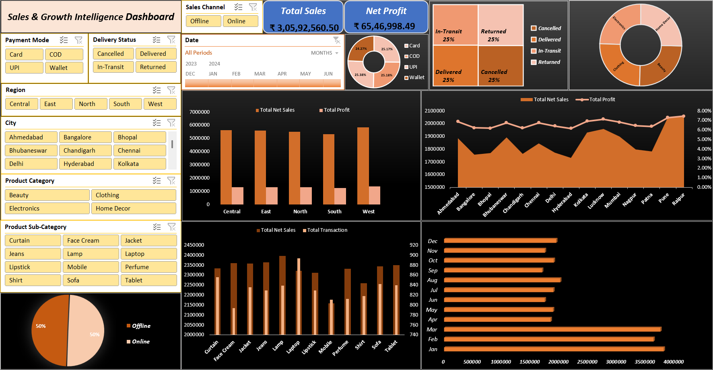

# 📊 Sales & Growth Intelligence Dashboard

**An interactive Excel dashboard that analyzes sales performance, profitability, and growth trends across regions, products, and time.**

---

## 📚 Table of Contents
- [Overview](#overview)
- [Problem Statement](#problem-statement)
- [Dataset](#dataset)
- [Tools & Technologies](#tools-technologies)
- [Dashboard Highlights](#dashboard-highlights)
- [How to Explore the Dashboard Interactively](#how-to-explore)
- [Project Structure](#project-structure)
- [Key Learnings](#key-learnings)
- [Dashboard Preview](#dashboard-preview)
- [Results & Conclusion](#results)
- [Author](#author)

---

## 📌 Overview 

The **Sales & Growth Intelligence Dashboard** transforms raw transactional sales data into clear, actionable business insights.

It provides a consolidated view of key metrics and enables users to explore trends, patterns, and comparisons across multiple dimensions through an interactive Excel-based interface.

The project emphasizes **clarity, structure, and insight-driven visualization** to support better decision-making.

---

## 🎯 Problem Statement 

Businesses often struggle to:
- Track overall sales and profit performance
- Understand regional and product-level trends
- Identify growth opportunities and operational bottlenecks
- Make sense of large volumes of transactional data

This project addresses these challenges by presenting critical metrics and trends in a single, easy-to-explore view.

---

## 📂 Dataset 

- **File:** `raw_dataset.xlsx`
- **Location:** `data/`

The dataset includes transactional sales data such as:
- Sales and profit values  
- Product categories and sub-categories  
- Regions and cities  
- Payment modes  
- Order delivery status  
- Monthly time-based records  

---

## 🛠 Tools & Technologies 

- Microsoft Excel  
- Pivot Tables & Pivot Charts  
- Slicers & Filters  
- Data Cleaning & Transformation  
- Dashboard Design Principles  

---

## 📈 Dashboard Highlights 

The dashboard provides insights into:
- **Total Sales and Net Profit KPIs**
- **Online vs Offline Sales Performance**
- **Payment Mode Distribution**
- **Order Delivery Status Analysis**
- **Region-wise and City-wise Trends**
- **Product Category & Sub-category Performance**
- **Monthly Sales Trends**
- **Quantity Sold vs Net Sales Comparison**

---

## 🔍 How to Explore the Dashboard Interactively 

To experience the full interactivity of the dashboard:

1. **Download the dashboard file**:  
   👉 [sales_and_growth_intelligence_dashboard.xlsx](dashboard/sales_and_growth_intelligence_dashboard.xlsx)
    - Then click **View raw** to download it

3. **Open it in Microsoft Excel** (desktop version recommended).

4. Use the interactive **slicers** to filter data by:
- Date
- Sales Channel
- Payment Mode
- Delivery Status
- Region
- City
- Product Category & Sub-category

4. Selecting different slicer values dynamically updates:
- KPIs (Total Sales, Net Profit)
- Charts and comparisons
- Trends across regions, products, and time

---

## 📁 Project Structure 

    sales-and-growth-intelligence-dashboard/
    ├── README.md
    ├── data/
    │   └── raw_dataset.xlsx
    ├── dashboard/
    │   └── sales_and_growth_intelligence_dashboard.xlsx
    └── screenshots/
        └── dashboard_overview.png

---

## 🚀 Key Learnings 

- Learned how to structure raw transactional data for meaningful analysis  
- Improved ability to identify sales and growth patterns across regions and products  
- Gained hands-on experience in building interactive dashboards using Excel slicers  
- Learned to design dashboards that balance insights, clarity, and usability  
- Strengthened data storytelling skills by translating complex metrics into clear visuals  
- Developed a better understanding of business-focused KPIs and performance tracking  

---
## 🖼 Dashboard Preview 

---

## ✅ Results & Conclusion 

The dashboard successfully provides a structured and interactive way to:
- monitor business performance,
- identify trends and patterns,
- compare metrics across multiple dimensions,
- support data-driven decision-making.

It demonstrates how Excel can be effectively used for analytical and business intelligence tasks.

---  

## 👤 Author 

**Jagjeet Singh**  
Aspiring Data Analyst  

